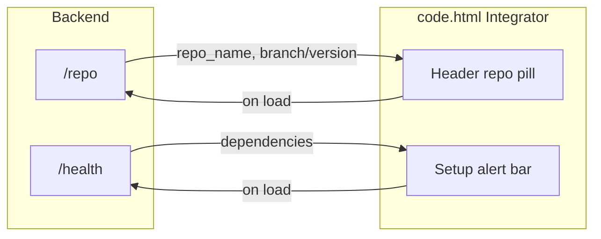

# Page 1: Dashboard and Repo Docking

## Scope and context

- **Focus**: Ghostfolio financial agent first; "what's domain vs universal" is deferred until after this page and later pages are built. Repo and health are universal; branding and quick actions (e.g. "Analyze portfolio") are Ghostfolio-specific and can be swapped later.
- **Existing**: FastAPI backend in [src/api/routes.py](src/api/routes.py) with `/health`, `/chat`, `/portfolio`, etc. Current Streamlit app in [app/streamlit_app.py](app/streamlit_app.py) will be **replaced entirely** by the Stitch frontend. Stitch UI: [code.html](stitch-downloads/3023668461815052031/code.html) (Ghostfolio AI Integrator) and [screen.png](stitch-downloads/3023668461815052031/screen.png) as reference.
- **Goal**: Use **code.html** as the framework frontend. **Repo Docking** = header pill showing repo name and version (e.g. ghostfolio/core v2.4.0), wired to `GET /repo`. **Dashboard** = first nav tab (optional separate view or reuse Analysis as landing). Top alert "Missing Critical API Keys" wired to `GET /health` (show when dependencies are missing). Serve the HTML from the app and add JS to fetch `/repo` and `/health` on load. **Streamlit is fully replaced** by this frontend; Chat and Evaluations will be added as Integrator pages in later work.

---

## 1. Backend: Repo info endpoint

**Add `GET /repo` (or `GET /repo/info`) in [src/api/routes.py](src/api/routes.py).**

- **Response shape** (suggested): `repo_name`, `repo_url`, `branch`, `commit_sha` (optional), `open_in_ide_url` (optional). All fields optional string so the endpoint never fails when git/env is missing.
- **Source of truth**:
  - **Option A (recommended)**: Prefer env vars `REPO_URL`, `REPO_NAME`, `REPO_BRANCH`, `OPEN_IN_IDE_URL` for deployment (Docker/Railway often have no git). If not set, try reading git at runtime (e.g. `subprocess` to `git rev-parse`, `git remote get-url`, `git branch --show-current`) with a safe fallback (no git → return nulls or defaults).
  - **Option B**: Git-only (simpler, but in Docker/Railway you’d set env or bake repo info at build time).
- **New Pydantic model**: e.g. `RepoInfoResponse` in routes with the fields above. Tag as `["System"]` or `["Repo"]`.
- **Tests**: Add a test in [tests/test_api/test_routes.py](tests/test_api/test_routes.py) that calls `GET /repo` and asserts structure (and optionally env/mock git behavior).

No changes to [src/utils/config.py](src/utils/config.py) required unless you add `repo_url`, `repo_branch`, etc. to Settings for env-based config.

---

## 2. Frontend: Ghostfolio AI Integrator (code.html)

**Use [stitch-downloads/3023668461815052031/code.html](stitch-downloads/3023668461815052031/code.html) as the framework UI.** Layout matches [screen.png](stitch-downloads/3023668461815052031/screen.png): header with repo pill, nav (Dashboard, Analysis, Agents), Sync Fork, top alert, File Explorer, and main area (Codebase Analysis and Mapping).

- **Serve the frontend**: Copy or mount the Stitch HTML into a `frontend/` or `static/` directory. FastAPI: serve static files and route `/` to the Integrator (e.g. index.html or code.html).
- **Repo docking (header pill)**: Wire to `GET /repo`; set pill to repo_name and branch/version; fallback on failure.
- **Setup alert**: Drive from `GET /health`; show alert when dependencies include false (openai, ghostfolio, etc.); "Setup Alert" can link to settings later.
- (Code.html uses the Setup alert for status; no separate agent status section.)
- **Dashboard tab**: For Page 1, keep Analysis as default; one HTML page with repo and health wired is sufficient.

- **JS**: On load, call API for `GET /repo` and `GET /health`; update repo pill and alert. Vanilla JS.

---

## 3. Data flow (high level)

---

## 4. Files to touch

| Area | File | Change |
|------|------|--------|
| Backend | [src/api/routes.py](src/api/routes.py) | Add `RepoInfoResponse` model; add `GET /repo` with git + env logic (or small helper in `src/utils/`). |
| Config (optional) | [src/utils/config.py](src/utils/config.py) | Optional: `repo_url`, `repo_name`, `repo_branch`, `open_in_ide_url` from env. |
| Tests | [tests/test_api/test_routes.py](tests/test_api/test_routes.py) | Test `GET /repo` response shape and status. |
| Frontend | New `frontend/` (or `static/`) | Copy [code.html](stitch-downloads/3023668461815052031/code.html) into served directory; add JS to fetch `/repo` and `/health` and update repo pill + alert. Ensure API base URL is configurable (e.g. same-origin or env). |
| Backend serve | [src/api/routes.py](src/api/routes.py) or main app | Mount `StaticFiles` for frontend directory; optional catch-all route so `/` serves the Integrator (e.g. `index.html` or `code.html`). |
| Replace Streamlit | [app/streamlit_app.py](app/streamlit_app.py), Dockerfile.frontend, railway.frontend.toml | Remove or deprecate Streamlit; make the Stitch-served frontend the single app entry. Update deployment to serve the new frontend (e.g. same FastAPI process or separate static host). |

---

## 5. Out of scope for this plan

- Implementing other Stitch pages (Strategy, Tool Library, Verification, etc.); only placeholders/links from the Integrator nav for now.
- Building Chat or Evaluations views inside the Integrator (later pages).
- Domain vs universal split (handled later when adding other domains).
- Auth or user-specific repo (single-tenant repo docking only).

---

## 6. Implementation order

1. Backend: Add `RepoInfoResponse` and `GET /repo` in routes; optional config and git/env helper.
2. Tests: Add route test for `/repo`.
3. Frontend: Create `frontend/` (or `static/`); copy code.html; add JS to fetch `/repo` and `/health` and update the header repo pill and the top setup alert. Mount static files in FastAPI and serve the Integrator as the app entry (e.g. `/` or `/app`).
4. Replace Streamlit: Remove or deprecate [app/streamlit_app.py](app/streamlit_app.py); update Dockerfile.frontend (or remove frontend service) and Railway config so the single deployed entry is the FastAPI app serving the Stitch frontend. Chat/Evaluations will be added as pages within the Integrator in later work.
